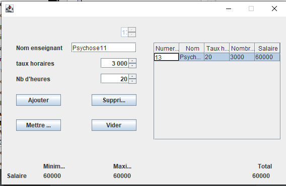

# Mon Projet

Bienvenue 😎

## 📝 Table des matières

1. [Introduction](#introduction)
2. [Fonctionnalités](#fonctionnalités)
3. [Installation](#installation)
5. [Captures d'écran](#captures-décran)

## 🚀 Introduction

Ceci est juste un projet java de l'école, sorry le design est éclaté
## 🎯 Fonctionnalités

- CRUD d'une table enseignant

## 🛠️ Installation

Pour installer ce projet, suivez ces étapes :

1. Clonez le dépôt : `git clone https://github.com/Psychose11/java_restNode.git`
2. Installez les dépendances pour le backend(le backend est celui d'abdnego ,oui la flemme frr 💫): `npm install`
3. Pour le client Java (eclipse IDE et windowBuilder)

## 🖼️ Captures d'écran

Ajoutez des captures d'écran de votre application ou de votre projet ici.

## 🤝 Contribuer

Toute contribution à ce projet est la bienvenue ! Pour contribuer, suivez ces étapes :

1. Fork le projet
2. Créez une branche pour votre fonctionnalité : `git checkout -b fonctionnalité`
3. Faites vos modifications
4. Validez vos modifications : `git commit -m "Ajout de la fonctionnalité"`
5. Push vers la branche : `git push origin fonctionnalité`
6. Soumettez une demande de tirage

## 📄 Licence

Ce projet est sous licence MIT. Voir le fichier [LICENSE](LICENSE) pour plus de détails.
